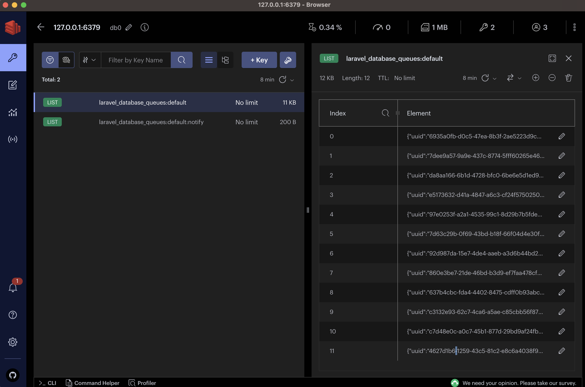

# Introduction 

This is a project built with Laravel 10 that uses BasicEvent and BasicEventListener to dispatch events. The events are dispatched asynchronously using Redis as the message broker.

To install the project, you can use Composer:

```bash
composer install
````

After that, you need to create a .env file by copying the .env.example file and filling in the necessary information.

```bash
cp .env.example .env
````

You also need to generate an application key:

```bash
php artisan key:generate
````

You also need to build the Redis Docker (I dont have time to create php-fpm, sorry)

```bash
docker-compose up -d
````

Enter: 

http://localhost:8080/api/event

The will dispatch the event and call all the listeners that are registered to handle this event.


